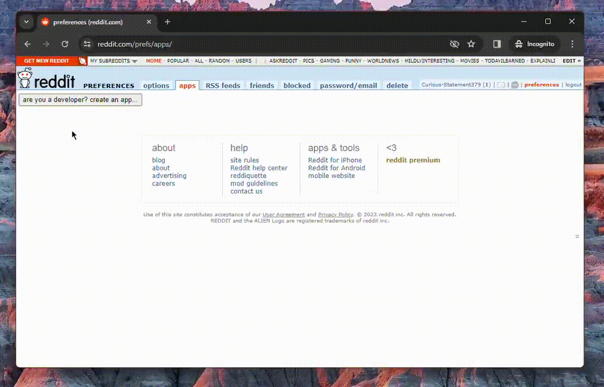

# Reddit-Telegram Forwarder

Spring Boot-based Java application to forward Reddit posts to Telegram channel.

# Requirements

- `Java 21`
- `Maven`
- [Reddit](https://www.reddit.com/login/) profile
- [Telegram](https://web.telegram.org/a/) profile
- Telegram channel
- A chat connected to your Telegram channel

# Quickstart

1. Go to https://www.reddit.com/prefs/apps and create an app.
    * Application type must be `script`.

      
2. Create Telegram Bot. You'll need a bot token.
    * [How Do I Create a Bot?](https://core.telegram.org/bots#how--o-i-create-a-bot)
3. Get the app.
    * Clone and build the project:
        ```shell
        git clone https://github.com/yvasyliev/reddit-telegram-repeater.git
        mvn clean package -Dmaven.test.skip
        cd target
        ```
    * Or
      download [executable JAR](https://github.com/yvasyliev/reddit-telegram-forwarder/releases/latest/download/reddit-telegram-forwarder-3.1.0.jar)
      from the [latest release](https://github.com/yvasyliev/reddit-telegram-forwarder/releases/latest).
4. Run the app:
   ```shell
   java -jar reddit-telegram-forwarder-3.1.0.jar \
   --reddit.client.id=${REDDIT_CLIENT_ID} \
   --reddit.client.secret=${REDDIT_CLIENT_SECRET} \
   --reddit.password=${REDDIT_PASSWORD} \
   --reddit.subreddit=${SUBBREDDIT_NAME} \
   --reddit.username=${REDDIT_USERNAME} \
   --telegram.admin.id=${TELEGRAM_ADMIN_ID} \
   --telegram.bot.token=${TELEGRAM_BOT_TOKEN} \
   --telegram.bot.username=${TELEGRAM_BOT_USERNAME} \
   --telegram.channel.id=${TELEGRAM_CHANNEL_ID} \
   --telegram.chat.id=${TELEGRAM_CHAT_ID}
   ```
    * Don't forget to replace `${...}` placeholders with correct values.

# How it works

This a console application built with `Spring Boot` (not Web!).
There is a
method [ScheduledPostManager#shareNewPosts](src/main/java/com/github/yvasyliev/service/telegram/ScheduledPostManager.java#L26)
annotated with `@Scheduled`.
This method retrieves subreddit new posts using [Reddit API](https://www.reddit.com/dev/api/) and forwards them to
Telegram channel using [Telegram Bots API](https://core.telegram.org/bots/api).
By default, `shareNewPosts()` is invoked once per minute, and it can be configured by environment variables (see [Application variables](#application-variables)).

If post author is in block list or the post is marked as NSFW, the post will be sent to admin for validation. Admin can
either accept or reject posts.

Block list is stored in `SQLite` database. All database configs and management are handled automatically
by `Spring Boot Data`.
No user actions required.

Additionally, this application runs
a [Long Polling Bot](src/main/java/com/github/yvasyliev/bots/telegram/RedditTelegramForwarderBot.java) that helps you
with application management.
The bot can accept suggested user posts (see [Bot commands](#bot-commands)).

# Application variables

As you noticed, the application relies on a set of variables.
Since it's a `Spring Boot` project, these variables can be passed as command line arguments (see [Quickstart](#quickstart)), defined in [application.properties](src/main/resources/application.properties) or set
globally as environment variables (see [Spring Boot Docs](https://docs.spring.io/spring-boot/docs/current/reference/html/features.html#features.external-config)
for more details).

|                   Variable                   | Required | Default value | Description                                                                                                                                                                                                                                               | Example                                          |
|:--------------------------------------------:|:--------:|:-------------:|:----------------------------------------------------------------------------------------------------------------------------------------------------------------------------------------------------------------------------------------------------------|:-------------------------------------------------|
| `delayed.blocking.executor.delay.in.seconds` | `false`  |     `20`      | Delay in seconds used to postpone sending messages in order to avoid "too many requests" errors in Telegram.                                                                                                                                              | `20`                                             |
|      `http.request.timeout.in.minutes`       | `false`  |      `2`      | Timeout in minutes applied to Reddit API call.                                                                                                                                                                                                            | `5`                                              | 
|     `reddit.authors.blocked.by.default`      | `false`  |    `false`    | `true` - check Reddit autor against Block list. `false` - ignore Block list and ask admin to validate every post.                                                                                                                                         | `true`                                           |
|              `reddit.client.id`              |  `true`  |       -       | Reddit `client_id`.                                                                                                                                                                                                                                       | `pW134F0XNuueG4W78x9uGA`                         |
|            `reddit.client.secret`            |  `true`  |       -       | Reddit client `secret`.                                                                                                                                                                                                                                   | `fsdT6VkTgf1WMfSW6Pd5t4DRvfVueB`                 |
|              `reddit.password`               |  `true`  |       -       | Reddit profile password.                                                                                                                                                                                                                                  | `ETD1fqx%cfk6odj#boj`                            |
|              `reddit.subreddit`              |  `true`  |       -       | Subreddit name without `r/` prefix.                                                                                                                                                                                                                       | `cats`                                           |
|              `reddit.username`               |  `true`  |       -       | Reddit profile username.                                                                                                                                                                                                                                  | `RedditProfileUsername000`                       |
|             `telegram.admin.id`              |  `true`  |       -       | Telegram user ID (Telegram channel admin ID). Bot will send error logs directly to user. <ul><li>[How to find your User ID in Telegram?](https://www.google.com/search?q=How+to+find+your+User+ID+in+Telegram%3F)</li></ul>                               | `280538130`                                      |
|           `telegram.bot.username`            |  `true`  |       -       | Telegram bot username.                                                                                                                                                                                                                                    | `SubredditForwarderBot`                          |
|             `telegram.bot.token`             |  `true`  |       -       | Telegram bot token.                                                                                                                                                                                                                                       | `4336854599:BBFqVLRq9ixVdxORFWQgaSywzCfRo5-tBus` |
|            `telegram.channel.id`             |  `true`  |       -       | Telegram channel ID. Subreddit posts will be sent to this channel. <ul><li>[How to get the channel ID](https://gist.github.com/mraaroncruz/e76d19f7d61d59419002db54030ebe35#new-improved-next-steps)</li></ul>                                            | `-1001572613876` or `@SubredditPostChannel`      |
|              `telegram.chat.id`              |  `true`  |       -       | The ID of the chat where users can leave comments under posts. Bot will send additional photos to this chat if orginal subreddit post contains more than 10 images. <ul><li>[How to get chat ID](https://stackoverflow.com/a/69302407/21234935)</li></ul> | `-1003810089009` or `@SubbredditPostChannelChat` |
| `telegram.schedule.posting.delay.in.minutes` | `false`  |      `1`      | How often (in minutes) the application should scan subreddit for new posts.                                                                                                                                                                               | `5`                                              |
|     `telegram.schedule.posting.enabled`      | `false`  |    `true`     | Should application start forwarding right after startup or not. Can be paused/resumed via [Bot commands](#bot-commands).                                                                                                                                  | `false`                                          |

# Bot commands

There are two types of commands:

- `user` - available for all users;
- `admin` - available for admin only.

|     Command      |  Type   | Description                                                                                                                                                                                                                                                                                         |
|:----------------:|:-------:|:----------------------------------------------------------------------------------------------------------------------------------------------------------------------------------------------------------------------------------------------------------------------------------------------------|
|  `/blockauthor`  | `admin` | Add Reddit user to Block list.                                                                                                                                                                                                                                                                      |
|    `/cancel`     | `user`  | Cancel current command.                                                                                                                                                                                                                                                                             |
| `/contactadmin`  | `user`  | Send message to admin.                                                                                                                                                                                                                                                                              |
|     `/done`      | `user`  | Same as `/cancel`.                                                                                                                                                                                                                                                                                  |
|  `/getblocked`   | `admin` | Show block list.                                                                                                                                                                                                                                                                                    |
|     `/help`      | `user`  | Show list of commands.                                                                                                                                                                                                                                                                              |
| `/pauseposting`  | `admin` | Pause posts forwarding.                                                                                                                                                                                                                                                                             |
| `/resumeposting` | `admin` | Resume posts forwarding.                                                                                                                                                                                                                                                                            |
|     `/start`     | `user`  | Same as `/help`.                                                                                                                                                                                                                                                                                    |
|     `/stop`      | `admin` | Completely stop the application. <ul><li>You can start it again by executing `java -jar ...`.</li><li>It takes up to ~30 seconds to stop all the processes.</li><li>Some exceptions can be thrown because of interrupted threads or closed application context. It's fine to ignore them.</li></ul> |
|  `/suggestpost`  | `user`  | Suggest a post to channel. The post will be sent to admin for validation.                                                                                                                                                                                                                           |
| `/unblockauthor` | `admin` | Remove Reddit user from block list.                                                                                                                                                                                                                                                                 |